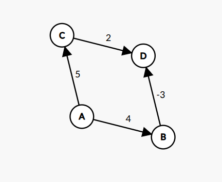
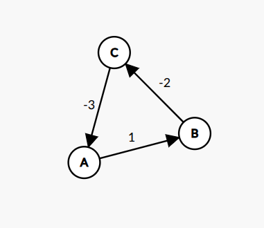

## 1. Introduction

The **Bellman–Ford algorithm** is a single-source shortest path algorithm used to find the minimum distance from a given source vertex to all other vertices in a weighted graph. Unlike Dijkstra's algorithm, Bellman–Ford **can handle graphs with negative edge weights** and is also capable of **detecting negative weight cycles**.

The algorithm works by repeatedly relaxing all edges of the graph. After V-1 iterations, the shortest distances are guaranteed to be found if no negative weight cycle exists.

---

## 1.1 Notation Table

| Symbol         | Meaning                                      |
|--------------- |----------------------------------------------|
| G(V, E)        | Graph with vertices V and edges E            |
| V              | Set of vertices                              |
| E              | Set of edges                                 |
| S              | Source vertex                                |
| u, v           | Vertices in the graph                        |
| w              | Weight of an edge                            |
| dist[v]        | Current shortest distance to vertex v        |

---

## 2. Problem Definition

**Given:**
* A directed graph **G(V, E)**
* A source vertex **S**
* Edge weights that may be positive, zero, or negative

> **Important:** For an **undirected graph with a negative-weight edge**, Bellman-Ford is not applicable for shortest paths because that edge can be traversed in both directions, creating a negative cycle of length 2.

**Find:**
* The shortest distance from **S** to every other vertex
* Detect if a **negative weight cycle** is present

---

## 3. Key Idea

The algorithm is based on **edge relaxation**:

> For an edge `(u → v)` with weight `w`:
>
> If `dist[u] + w < dist[v]`, then update `dist[v] = dist[u] + w`

The algorithm relaxes all edges V-1 times because:
* After 1 iteration: shortest paths with at most 1 edge are found
* After k iterations: shortest paths with at most k edges are found
* After V-1 iterations: all shortest paths are found

---

## 4. Algorithm Steps

1. Initialize distance of all vertices as **∞**, source as **0**
2. Repeat **(V − 1) times**: For every edge `(u → v)`, if `dist[u] + w < dist[v]`, update `dist[v]`
3. Check for negative cycles: If any edge can still be relaxed, negative cycle exists

---

## 5. Why (V − 1) Iterations?

The longest possible shortest path in a graph with **V vertices** can have at most **V − 1 edges**. After V-1 iterations, all shortest paths are guaranteed to be found.

---

## 6. Pseudocode

```
BellmanFord(Graph, V, E, source):
    // Initialize
    for each vertex v in V:
        dist[v] ← ∞
        predecessor[v] ← NULL
    dist[source] ← 0

    // Relax edges V-1 times
    for i = 1 to V - 1:
        for each edge (u, v, w) in E:
            if dist[u] ≠ ∞ and dist[u] + w < dist[v]:
                dist[v] ← dist[u] + w
                predecessor[v] ← u

    // Check for negative cycles
    for each edge (u, v, w) in E:
        if dist[u] ≠ ∞ and dist[u] + w < dist[v]:
            return "Negative cycle detected"
    
    return dist
```

---

## 7. Example

### 7.1 Graph Setup



**Graph Properties:**
- **Vertices (V):** {A, B, C, D} → |V| = 4
- **Edges (E):** {A→B, A→C, B→D, C→D} → |E| = 4
- **Source vertex:** A

**Edge List with Weights:**

| Edge   | Weight | Description           |
| ------ | ------ | --------------------- |
| A → B  | 4      | Positive edge         |
| A → C  | 5      | Positive edge         |
| B → D  | -3     | **Negative edge**     |
| C → D  | 2      | Positive edge         |

> **Note:** This graph contains a negative edge weight (B→D = -3), which is why we use Bellman-Ford instead of Dijkstra.

---

### 7.2 Step-by-Step Execution

#### **Initialization**

Set distance of source to 0, all others to ∞:

| Vertex | dist[] | predecessor[] |
| ------ | ------ | ------------- |
| A      | 0      | NULL          |
| B      | ∞      | NULL          |
| C      | ∞      | NULL          |
| D      | ∞      | NULL          |

**Number of iterations required:** V - 1 = 4 - 1 = **3 iterations**

---

#### **Iteration 1**

Relax all edges:

| Edge   | Condition                        | Action                              | Updated dist[] |
| ------ | -------------------------------- | ----------------------------------- | -------------- |
| A → B  | dist[A] + 4 < dist[B] → 0 + 4 < ∞ | **Update:** dist[B] = 4, pred[B] = A | dist[B] = 4    |
| A → C  | dist[A] + 5 < dist[C] → 0 + 5 < ∞ | **Update:** dist[C] = 5, pred[C] = A | dist[C] = 5    |
| B → D  | dist[B] + (-3) < dist[D] → 4 - 3 < ∞ | **Update:** dist[D] = 1, pred[D] = B | dist[D] = 1    |
| C → D  | dist[C] + 2 < dist[D] → 5 + 2 < 1 | No update (7 > 1)                   | dist[D] = 1    |

**State after Iteration 1:**

| Vertex | dist[] | predecessor[] |
| ------ | ------ | ------------- |
| A      | 0      | NULL          |
| B      | 4      | A             |
| C      | 5      | A             |
| D      | 1      | B             |

---

#### **Iteration 2**

Relax all edges again:

| Edge   | Condition                        | Action                 |
| ------ | -------------------------------- | ---------------------- |
| A → B  | 0 + 4 < 4 → 4 < 4                | No update (4 = 4)      |
| A → C  | 0 + 5 < 5 → 5 < 5                | No update (5 = 5)      |
| B → D  | 4 + (-3) < 1 → 1 < 1             | No update (1 = 1)      |
| C → D  | 5 + 2 < 1 → 7 < 1                | No update (7 > 1)      |

**No changes in Iteration 2** — distances have converged.

---

#### **Iteration 3**

Relax all edges again:

| Edge   | Condition         | Action               |
| ------ | ----------------- | -------------------- |
| A → B  | 4 < 4             | No update            |
| A → C  | 5 < 5             | No update            |
| B → D  | 1 < 1             | No update            |
| C → D  | 7 < 1             | No update            |

**No changes in Iteration 3** — algorithm complete.

---

#### **Negative Cycle Check**

After V-1 iterations, check if any edge can still be relaxed:

| Edge   | Condition         | Result               |
| ------ | ----------------- | -------------------- |
| A → B  | 0 + 4 < 4?        | No                   |
| A → C  | 0 + 5 < 5?        | No                   |
| B → D  | 4 + (-3) < 1?     | No                   |
| C → D  | 5 + 2 < 1?        | No                   |

**No negative cycle detected** — shortest paths are valid!

---

### 7.3 Final Result

| Vertex | Shortest Distance | Shortest Path | Edges in Path |
| ------ | ----------------- | ------------- | ------------- |
| A      | 0                 | A             | 0             |
| B      | 4                 | A → B         | 1             |
| C      | 5                 | A → C         | 1             |
| D      | 1                 | A → B → D     | 2             |

**Path Reconstruction:**
- **A to D:** Follow predecessors: D ← B ← A → Path: **A → B → D** (cost: 4 + (-3) = 1)
- **A to B:** Follow predecessors: B ← A → Path: **A → B** (cost: 4)
- **A to C:** Follow predecessors: C ← A → Path: **A → C** (cost: 5)

---

### 7.4 Visualization Summary

```


Iteration 0 (Initial):    A=0,  B=∞,  C=∞,  D=∞
Iteration 1:              A=0,  B=4,  C=5,  D=1
Iteration 2:              A=0,  B=4,  C=5,  D=1  (no change)
Iteration 3:              A=0,  B=4,  C=5,  D=1  (no change)

Final shortest paths from A:
    A ──(0)──> A
    A ──(4)──> B
    A ──(5)──> C  
    A ──(1)──> D  (via B, using negative edge!)


```

---

## 8. Negative Weight Cycle Detection

A **negative weight cycle** is a cycle with total negative weight. If it exists, shortest paths are undefined.

**Detection:** After V-1 iterations, if any edge can still be relaxed, a negative cycle exists.

**Example:**
```

A → B → C → A with weights 1, -2, -3
Total: 1 + (-2) + (-3) = -4 (negative cycle!)


```

---

## 9. Time and Space Complexity

| Metric          | Complexity   |
| --------------- | ------------ |
| Time            | **O(V × E)** |
| Space           | **O(V)**     |

---

## 10. Advantages

*  Works with **negative edge weights**
*  Detects **negative weight cycles**
*  Simple implementation
*  Guarantees correct shortest paths
*  Can reconstruct paths using predecessor array

---

## 11. Disadvantages

*  Slower than Dijkstra (O(V×E) vs O(E log V))
*  Inefficient for large dense graphs
*  Basic version runs V-1 iterations; optimized implementations can terminate early if an iteration makes no updates
*  Not suitable for real-time applications

---

## 12. Applications

* **Network Routing:** RIP protocol uses Bellman-Ford
* **Currency Arbitrage:** Detecting profitable exchange cycles
* **Traffic Networks:** Finding shortest routes with penalties
* **Game Theory:** Computing optimal strategies
* **Resource Allocation:** Optimizing costs with benefits
* **Constraint Satisfaction:** Solving temporal constraints

---

## 13. Comparison with Dijkstra's Algorithm

### 13.1 Feature Comparison

| Feature                    | Bellman–Ford       | Dijkstra              |
| -------------------------- | ------------------ | --------------------- |
| **Negative edge weights**  | Yes                | No                    |
| **Negative cycle detection** | Yes              | No                    |
| **Time complexity**        | O(V × E)           | O(E log V)            |
| **Space complexity**       | O(V) auxiliary (or O(V + E) including graph storage) | O(V + E) (binary heap + adjacency list) |
| **Approach**               | Dynamic Programming | Greedy                |
| **Data structure**         | Simple arrays      | Priority Queue (Heap) |
| **Edge processing**        | All edges, V-1 times | Adjacent edges only  |
| **Early termination**      | Not in basic version (yes with no-update optimization) | Yes (when target found) |
| **Best for**               | Negative weights, cycle detection | Non-negative weights, speed |

### 13.2 When to Use Which Algorithm?

**Use Bellman-Ford when:**
- Graph contains **negative edge weights**
- Need to **detect negative weight cycles**
- Graph is relatively sparse
- Correctness is more important than speed
- Working with financial/currency exchange problems

**Use Dijkstra when:**
- All edge weights are **non-negative**
- Need **faster execution** for large graphs
- Working with road networks, GPS navigation
- Graph is dense with many edges
- Real-time performance is required

### 13.3 Try Dijkstra's Algorithm

To better understand the differences, try the **Dijkstra's Algorithm simulation** on Virtual Labs:

🔗 **[Dijkstra's Algorithm - Virtual Lab Simulation](https://ds2-iiith.vlabs.ac.in/exp/dijkstra-algorithm/index.html)**

This interactive simulation allows you to:
- Visualize step-by-step execution of Dijkstra's algorithm
- Compare how it differs from Bellman-Ford
- Understand why Dijkstra fails with negative weights

---

## 14. Why Shortest Paths Are Undefined with Negative Cycles

If a graph contains a negative weight cycle, shortest paths become undefined because you can keep traversing the cycle to reduce the path cost indefinitely. Bellman-Ford **successfully detects** such cycles but **cannot compute shortest paths** when they exist.

### Example of a Negative Cycle



**Edge weights:**
- A → B: 1
- B → C: -2
- C → A: -3

**Total cycle weight:** 1 + (-2) + (-3) = -4 (negative)

**Explanation:**
Every time the algorithm goes around this cycle, the total path cost decreases by 4. This means there is no well-defined shortest path, as you can keep looping and getting a lower cost.

**Bellman-Ford's behavior:**
- After V-1 iterations, the algorithm checks for further relaxations. If any edge can still be relaxed, a negative cycle exists.
- In this case, the algorithm will detect the negative cycle and report it, rather than returning shortest paths.

---

## 15. Conclusion

The Bellman–Ford algorithm is essential for graphs with **negative edge weights** and **negative cycle detection**. While slower than Dijkstra's algorithm, its ability to handle negative weights makes it indispensable in network routing, financial modeling, and constraint-based optimization.